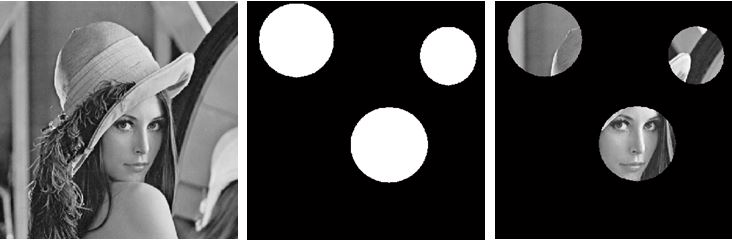

# Generating a Binary Mask

When working with images, selecting a specific region of an image to work with is quite common. Therefore I made a script in [MATLAB](./matlab) that allows you to generate a mask with one or more regions of interest (ROIs). The shape of the ROIs can be rectangular, elliptic, (irregular) polygon, or free-hand drawn.

<figure class="aligncenter">
	
  <figcaption>Original Lena, generated mask, and masked Lena.</figcaption>
</figure>
